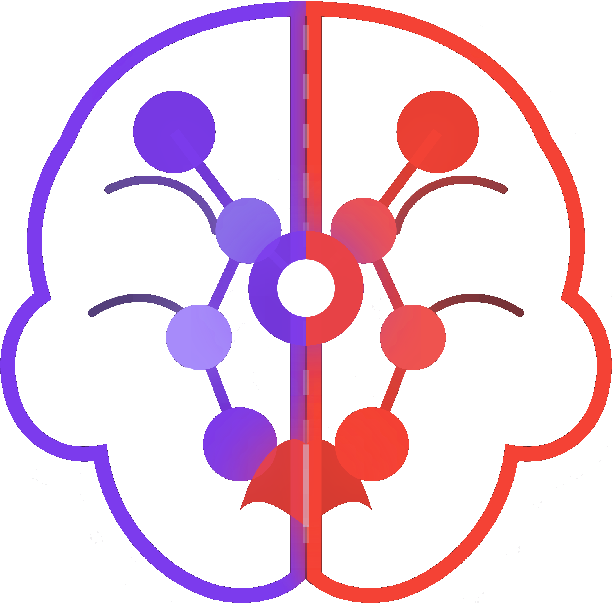

<p align="center">
  
</p>

<p align="center">
  <strong>Visualize your Laravel application's full request lifecycle as an interactive graph.</strong><br/>
  Understand how routes, controllers, services, models, jobs, events, commands, and channels connect — in seconds.
</p>

<p align="center">
  
  
  
  
  <br/><br/>
  <a href="https://www.buymeacoffee.com/MrMarchOne"></a>
</p>

---

## What is LaraMint\LaravelBrain?

LaraMint\LaravelBrain is a zero-config developer tool that analyzes your Laravel codebase and renders an interactive node graph of your application's architecture. It traces every route through its controller, services, repositories, models, jobs, events, Artisan commands, scheduled tasks, broadcast channels, and Filament panels — giving you a bird's-eye view of the entire application without reading a single line of code.

The scan writes JSON graph files to `storage/app/laravel-brain/`. The viewer is served at `/_laravel-brain` entirely through your existing Laravel routes — no separate server process needed.

## Features

- **Full lifecycle tracing** — Follows every route from HTTP verb → controller → service → repository → model → events/jobs
- **Filament PHP support** — Discovers panels, resources, pages, widgets, and relation managers; traces call chains from Filament page methods the same way controller actions are traced
- **Artisan command discovery** — Maps class-based commands, closure commands from `routes/console.php`, and Kernel-registered commands
- **Scheduler tracing** — Visualizes scheduled tasks (`command`, `job`, `call`) with their frequency
- **Broadcast channel mapping** — Discovers class-based and closure channels from `routes/channels.php`
- **DB query tracing** — Surfaces Eloquent and raw queries per method
- **Fat-class detection** — Flags controllers and services with more than 300 lines or 10 methods
- **Cyclomatic complexity** — Highlights hotspots by complexity tier (Low / Moderate / High / Critical)
- **Interactive graph** — Dark/light theme, accent-colored nodes, and interactive edges
- **Per-route tabs** — Each route gets its own isolated subgraph tab
- **Middleware mapping** — Shows which middleware guards each route
- **Model relationships** — Displays `hasMany`, `belongsTo`, and other Eloquent relations
- **Method flowcharts** — See internal flow as a step-by-step diagram with a large modal popup view
- **Sequence diagrams** — Route nodes render an SVG sequence diagram (exportable as PNG or Mermaid) showing the full actor chain
- **Source viewer** — Read the actual source file inline or in a focused popup
- **Export** — Export any graph as PNG or Mermaid diagram
- **Multiple layouts** — Hierarchical (dagre), force-directed (cose-bilkent), breadth-first, circle, grid
- **Watch mode** — Auto-rescans on PHP file changes
- **Route stress test** — From a selected **route** node, run concurrent HTTP load against that endpoint (via [`laramint/laravel-stress`](https://github.com/LaraMint/laravel-stress)): configure request count, concurrency, headers, body, and timeout; see timing percentiles (min/avg/p50/p95/p99/max), throughput, and status distribution in the sidebar. While a run is active, the graph highlights the route and animates packets along the request path
- **AI context export** — Copy a deterministic, token-optimized context snapshot for any node to your clipboard with one click (🤖 button in the sidebar). Also available as `brain:export-context` Artisan command and `GET /_laravel-brain/api/context` API endpoint. Context includes call chain, complexity hotspots, DB operations, source snippets, and all backend/frontend packages — always reproducible from the same scan data
- **AI rules generation** — Generate ready-to-use context files for seven AI coding assistants (Claude Code, Cursor, Windsurf, GitHub Copilot, JetBrains Junie, Aider, AGENTS.md) directly from the UI (**Export → Generate AI Rules**) or via `brain:generate-rules`. Each file is populated with your project's real architecture, routes, packages, and code-health data

## Requirements

- PHP 8.0+
- Laravel 9, 10, 11, 12, or 13
- Composer

## Installation

Install as a dev dependency (it's a development tool, not needed in production):

```bash
composer require --dev laramint/laravel-brain
```

Laravel will auto-discover the service provider. No manual registration needed.

## Usage

### Scan your project

```bash
php artisan brain:scan
```

This analyzes your entire codebase and writes the graph data to `storage/app/laravel-brain/`. When complete it prints the URL to open:

```
  LaraMint\LaravelBrain — analyzing project...
  Path: /your/project

  Scanning routes, controllers, models and call chains...

  Done! Open the viewer at: http://localhost:8000/_laravel-brain
```

#### Memory limit

The scanner defaults to **1024M**. On larger codebases you can raise the limit with `--memory-limit`:

```bash
php artisan brain:scan --memory-limit=1G
php artisan brain:scan --memory-limit=2G
php artisan brain:scan --memory-limit=2048M

# Unlimited (use with caution)
php artisan brain:scan --memory-limit=-1
```

Accepted formats: `<number>M` (megabytes), `<number>G` (gigabytes), or `-1` (unlimited). The minimum allowed value is `1024M`.

### Export AI context for a node

Click the **🤖** button in the node sidebar to copy a structured Markdown context block to your clipboard, ready to paste into Claude, ChatGPT, or any LLM.

The context is **deterministic**: same scan + same node = identical output every time. It uses BFS up to depth 3 from the selected node and enforces a token budget (default 6 000 tokens), truncating only source snippets once structural metadata is fully included.

You can also run it from the terminal:

```bash
# Full project summary
php artisan brain:export-context

# Focused on a specific route
php artisan brain:export-context --route="GET /users" --budget=4000

# Target a specific node ID
php artisan brain:export-context --node="action::App\Http\Controllers\UserController::index"

# Write to a file instead of stdout
php artisan brain:export-context --route="GET /api/orders" --output=/tmp/context.md

# JSON format
php artisan brain:export-context --format=json
```

Or via the API:

```
GET /_laravel-brain/api/context?nodeId=<id>&budget=6000
GET /_laravel-brain/api/context?route=GET+/users&format=json
```

The exported Markdown contains:

- **Route** — method, URI, middleware
- **Call chain** — `Route → Controller → Service → Model` (depth ≤ 3)
- **Complexity hotspots** — cyclomatic complexity + line count table
- **Database operations** — Eloquent and raw queries per node
- **Source snippets** — focal node first, truncated to fit the token budget
- **Backend packages** — all `composer.json` dependencies with versions, dev flag
- **Frontend packages** — all `package.json` dependencies with versions, dev flag

---

### Generate AI assistant rules files

Populate context files for your AI coding tools directly from the scan data.

**From the UI:** Toolbar → **Export** → **Generate AI Rules** → select targets → **Generate**.

**From the terminal:**

```bash
# Generate all 7 files at once
php artisan brain:generate-rules

# Specific targets only
php artisan brain:generate-rules --target=claude --target=cursor

# Preview paths without writing anything
php artisan brain:generate-rules --dry-run

# Overwrite existing files without prompting
php artisan brain:generate-rules --force
```

| Target | File written | Used by |
|--------|-------------|---------|
| `claude` | `CLAUDE.md` | Claude Code CLI & IDE extension |
| `cursor` | `.cursor/rules/laravel-brain.mdc` | Cursor (MDC format with frontmatter) |
| `windsurf` | `.windsurf/rules/laravel-brain.md` | Windsurf by Codeium |
| `copilot` | `.github/copilot-instructions.md` | GitHub Copilot (applied repo-wide) |
| `junie` | `.junie/guidelines.md` | JetBrains AI / Junie |
| `aider` | `CONVENTIONS.md` | Aider (`aider --read CONVENTIONS.md`) |
| `agents` | `AGENTS.md` | Universal open standard — 60+ tools |

Each generated file contains your project's tech stack, architecture counts, top routes, complexity hotspots, detected code smells, and full package lists. Re-run after every scan to keep the files current.

---

### Watch mode

Re-scan automatically whenever a PHP file changes:

```bash
php artisan brain:scan --watch
php artisan brain:scan --watch --interval=5   # poll every 5 seconds (default: 3)
```

### Open the viewer

Navigate to `/_laravel-brain` in your browser while your Laravel app is running (e.g. via `php artisan serve`).

## How It Works

```
php artisan brain:scan
        │
        ├─ RouteAnalyzer      → scans all files in routes/**/*.php
        ├─ MiddlewareAnalyzer → reads Kernel.php or bootstrap/app.php
        ├─ ControllerAnalyzer → resolves controller classes + methods
        ├─ MethodTracer       → deep-traces call chains (services, repos, models)
        ├─ ModelAnalyzer      → extracts Eloquent relationships
        ├─ QueryTracer        → surfaces DB queries per method
        ├─ ConsoleAnalyzer    → discovers Artisan commands and scheduled tasks
        ├─ ChannelAnalyzer    → discovers broadcast channels
        ├─ FilamentAnalyzer   → discovers panels, resources, pages, widgets, relation managers
        └─ GraphBuilder       → assembles nodes + edges, flags fat classes
                │
                └─ Writes JSON → storage/app/laravel-brain/

GET /_laravel-brain
        │
        └─ BrainController → serves the React SPA + graph JSON via Laravel routes
```

### Route discovery

LaravelBrain recursively scans your entire `routes/` directory — not just `web.php` and `api.php`. Any PHP file under `routes/**` is analyzed, including versioned files like `routes/v1/users.php` or module-specific files like `routes/modules/admin.php`.

#### Auto-discover mode

Set `'auto_discover_routes' => true` in `config/laravel-brain.php` to skip AST parsing and pull routes from the live Laravel router (`Route::getRoutes()`) instead. This captures routes registered programmatically by service providers and packages (Filament, Sanctum, Livewire, Telescope, etc.) that the AST scanner can't see.

By default, routes whose handler (controller class or closure) lives under your project's `vendor/` directory are excluded — so package-internal routes such as Telescope, Horizon, or Ignition stay out of the graph. Flip `'auto_discover_exclude_vendor' => false` if you want them included.

Both settings are env-overridable, so you can toggle them per-environment without editing the published config file:

```dotenv
LARAVEL_BRAIN_AUTO_DISCOVER_ROUTES=true
LARAVEL_BRAIN_AUTO_DISCOVER_EXCLUDE_VENDOR=false
```

To force auto-discover for a single scan without changing config, pass the flag:

```bash
php artisan brain:scan --auto-discover
```

> **Heads up:** in auto-discover mode the source file and line number of each route are not available, so the sidebar will not group routes by their declaring file (everything falls under a single group). Use the default AST mode if file/line grouping matters to you.

### Call chain tracing

From each controller action (and Filament page method), the tracer follows:
- Direct method calls to injected services/repositories
- Static calls (`MyService::method()`)
- Job dispatches (`dispatch(new SendEmail(...))`)
- Event dispatches (`event(new OrderPlaced(...))`)

This produces the full edge list used to build the graph.

### Filament PHP support

When Filament is installed, the scanner discovers every panel registered via service providers, then resolves its resources, pages, widgets, and relation managers — both explicitly listed (`->resources([...])`) and auto-discovered (`->discoverResources(for: '...')`). Filament page methods are traced through the same call-chain engine as controller actions, so models and services they touch appear in the graph.

## Graph Node Types

| Node | Accent Color | Represents |
|------|-------------|------------|
| Route | Green `#4CAF50` | HTTP endpoint (`GET /users`) |
| Middleware | Orange `#FF9800` | Middleware applied to a route |
| Controller | Blue `#2196F3` | Controller class |
| Action | Light Blue `#03A9F4` | Controller method |
| Service | Purple `#9C27B0` | Service or helper class |
| Model | Red `#F44336` | Eloquent model |
| Event | Yellow `#FFD600` | Laravel event |
| Job | Slate `#607D8B` | Queued job |
| Filament Panel | Violet `#7C3AED` | Filament panel definition |
| Filament Resource | Purple `#A855F7` | Filament resource class |
| Filament Page | Lavender `#C084FC` | Filament page class |
| Filament Page Method | Pink `#E879F9` | Method on a Filament page |
| Filament Widget | Cyan `#06B6D4` | Filament widget class |
| Filament Relation Manager | Teal `#0891B2` | Filament relation manager |

> **Note:** Command, Schedule, Channel, and Repository nodes are discovered and added to the graph but use the closest matching accent color from their parent type.

## Viewer Shortcuts

| Action | How |
|--------|-----|
| Zoom | Scroll wheel |
| Pan | Click + drag on canvas |
| Inspect node | Click any node |
| View source | Click a node → Source tab in sidebar |
| Source popup | Click ⤢ in source section to open focused view |
| View flowchart | Click a class node → Flow tab |
| Flowchart popup | Click ⤢ in flow section to open large view |
| View sequence diagram | Click a route node → Sequence Diagram section in sidebar |
| Filter by type | Filter panel on the left |
| Fit all nodes | Toolbar → Fit button |
| Export PNG | Toolbar → Export → Download PNG |
| Export Mermaid | Toolbar → Export → Copy Mermaid Code |
| Generate AI rules | Toolbar → Export → Generate AI Rules |
| Toggle theme | Toolbar → ☀️ / 🌙 button |
| Copy AI context | Click any node → 🤖 button in sidebar header |
| Stress test a route | Click a **route** node → open **Stress Test** in the sidebar → set options → **Run** |

## Routes Registered

The package registers the following routes in your application (all under the `/_laravel-brain` prefix):

```
GET  /_laravel-brain                          → Interactive graph viewer (SPA)
GET  /_laravel-brain/api/source               → Returns PHP source file content
POST /_laravel-brain/api/scan                 → Triggers a full project scan
GET  /_laravel-brain/api/context              → Exports a deterministic AI context snapshot
POST /_laravel-brain/api/generate-rules       → Generates AI assistant rules files
POST /_laravel-brain/api/stress-test          → Starts a stress-test job (or returns sync result)
GET  /_laravel-brain/api/stress-test/{id}     → Polls background job status/results
GET  /_laravel-brain/assets/*                 → Serves frontend static assets
GET  /_laravel-brain/.graph-*.json            → Serves graph data written by the scan
```

Stress testing uses [`laramint/laravel-stress`](https://github.com/LaraMint/laravel-stress), which is installed automatically as a dependency. Target URLs are validated server-side against an allowlist of development hosts: `localhost`, `127.0.0.1`, `*.test`, `*.local`, `*.ddev.site`, single-label Docker service names (e.g. `nginx`, `app`), private IPv4 ranges (`10.x`, `172.16–31.x`, `192.168.x`), and the host in `APP_URL`.

### Docker and stress testing

> **Docker?** The stress test subprocess runs **inside** the container — `localhost:8080` is the host-side mapped port and won't be reachable there. Change the **Base URL** field to the internal service address, e.g. `http://nginx` or `http://localhost:80`.

Single-label hostnames (Docker service names with no dots) and private IPv4 ranges are automatically allowed by the host validator, so pointing the Base URL at your internal network address will work without any extra config.

## Storage Driver

Scan output (the graph) can be persisted in one of two ways, selected with the
`driver` config key (env `LARAVEL_BRAIN_DRIVER`):

| Driver | Where it stores | Setup |
| --- | --- | --- |
| `file` (default) | `.graph-*.json` files under `storage/app/laravel-brain/` | none |
| `database` | a database table (`laravel_brain_graphs`) | none — table auto-created on first scan |

Use the `database` driver when `storage/` is not writable or not shared between
the web and CLI processes (read-only containers, multi-node deploys):

```dotenv
LARAVEL_BRAIN_DRIVER=database
# Optional — defaults to laravel_brain_graphs
LARAVEL_BRAIN_DB_TABLE=laravel_brain_graphs
```

By default it uses your app's default connection. You can instead point it at a
**dedicated database** with its own credentials — no need to edit
`config/database.php`. Set the connection name to the bundled `laravel-brain`
connection and fill in its credentials:

```dotenv
LARAVEL_BRAIN_DB_CONNECTION=laravel-brain

LARAVEL_BRAIN_DB_DRIVER=mysql
LARAVEL_BRAIN_DB_HOST=127.0.0.1
LARAVEL_BRAIN_DB_PORT=3306
LARAVEL_BRAIN_DB_DATABASE=laravel_brain
LARAVEL_BRAIN_DB_USERNAME=brain
LARAVEL_BRAIN_DB_PASSWORD=secret
```

Or set `LARAVEL_BRAIN_DB_CONNECTION` to the name of any existing connection
already defined in your `config/database.php`. All reads/writes honour the
chosen connection.

The graph table is **created automatically the first time you run a scan**
(`brain:scan` or the "Scan" button in the UI) — no `php artisan migrate` step
is required. If the table already exists, it is left untouched.

If you'd rather manage the table with your normal migrations instead, publish
the migration and run it yourself:

```bash
php artisan vendor:publish --tag=laravel-brain-migrations
php artisan migrate
```

## Output Files

With the default `file` driver, `brain:scan` writes these files to
`storage/app/laravel-brain/`:

```
.graph-manifest.json   — Tab manifest (list of all route tabs)
.graph-{tab-id}.json   — Per-route subgraph (one per route)
```

They are regenerated on every scan and are safe to gitignore:

```gitignore
storage/app/laravel-brain/
```

(The `database` driver stores the same payloads as rows in the configured table.)

## Security

The `/_laravel-brain` routes are only registered in the `local` environment by default. Since it's a `require-dev` dependency, it will not be present in production builds (`composer install --no-dev`).

If you do install it in a non-production environment accessible over a network, consider protecting the routes with middleware.

## Contributing

Pull requests are welcome. For major changes, please open an issue first to discuss what you'd like to change.

```bash
git clone https://github.com/LaraMint/laravel-brain
cd laravel-brain
composer install
cd frontend && npm install && npm run dev
```

Tests:

```bash
composer test
```

## License

MIT — see [LICENSE](LICENSE) for details.
